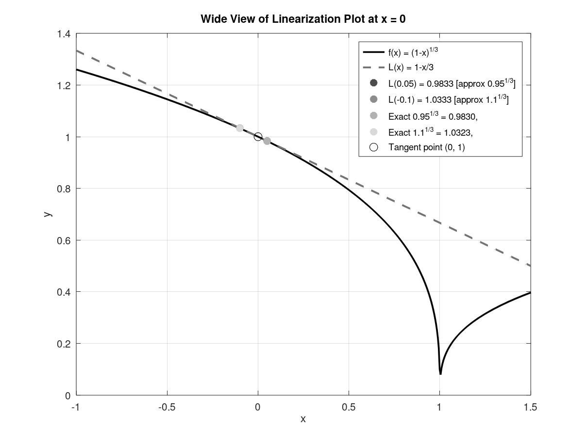
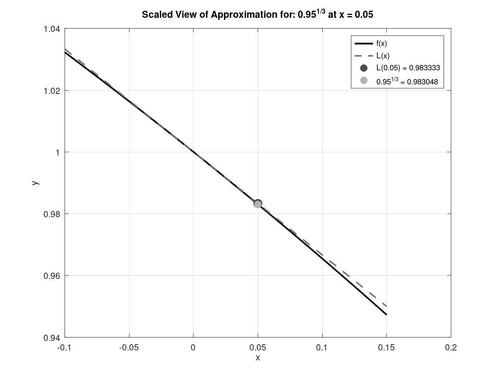
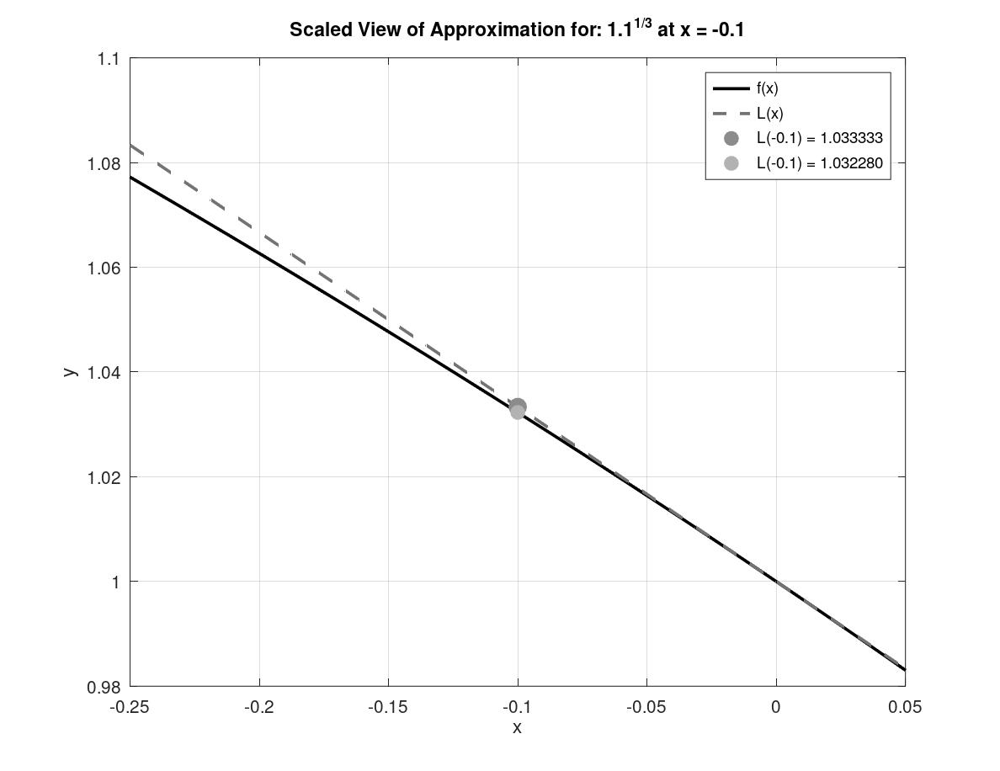

# Linearization and Newton's Method

## 1. Linearization

A reusable MATLAB/GNU Octave workflow that computes the tangent-line approxiamtion for any function $f(x)$, which is input as a string at a point $x=a$, which is input as a value.

For a differentiable function, $f(x)$, at a point $x=a$, the first-order Taylor approximation is: 

$$L(x) = f(a)+f'(a)(x-a)$$

Which coincides with the tangent line to the graph of $f$ at the point $(a,f(a))$

**Core linearization function:**

``` matlab
function L = lin(f_s, a)
  syms x

  f=sym(f_s);
  df=diff(f,x);
  fa=subs(f,x,a);
  dfa=subs(df,x,a);

  L=dfa*(x-a)+fa;
end
```

**Linearization computation**:

``` matlab
syms x
f_s=('%function input');
a='%tangent point input';

L=lin(f_s,a);
```
---

**1.1 Application:** $f(x)=(1-x)^{1/3}$

$$f'(x)= -\frac{1}{3}(1-x)^{-2/3}$$
$$f'(0)= -\frac{1}{3}$$
$$L(x)=1-\frac{x}{3}$$


**1.2 Graphs**

Three figures generated from the approximation computation program.

**1.2.1 $f(x)=(1-x)^{1/3}$** , $L(x)=1-\frac{x}{3}$.

<div align="center">

</div>

Figure 1: Wide view plot of linearization at tangent point $(0,1)$; it includes the subsequent numerical approximations (source: Author, 2026)

**1.2.2 Approximation of: $^3\sqrt{0.95}$**

<div align="center">

</div>


Figure 2: Scale near $x=0.05$ demonstrating error, $1.41 \times 10^{-4}$, between $L(0.05)$ and $f(0.05)$ (source: Author, 2026)

**1.2.3 Approximation of: $^3\sqrt{1.1}$**

<div align="center">

</div>

Figure 3: Scale near $x=-0.1$ demonstrating error, $1.05 \times 10^{-3}$, between $L(-0.1)$ and $f(-0.1)$ (source: Author, 2026)

---


